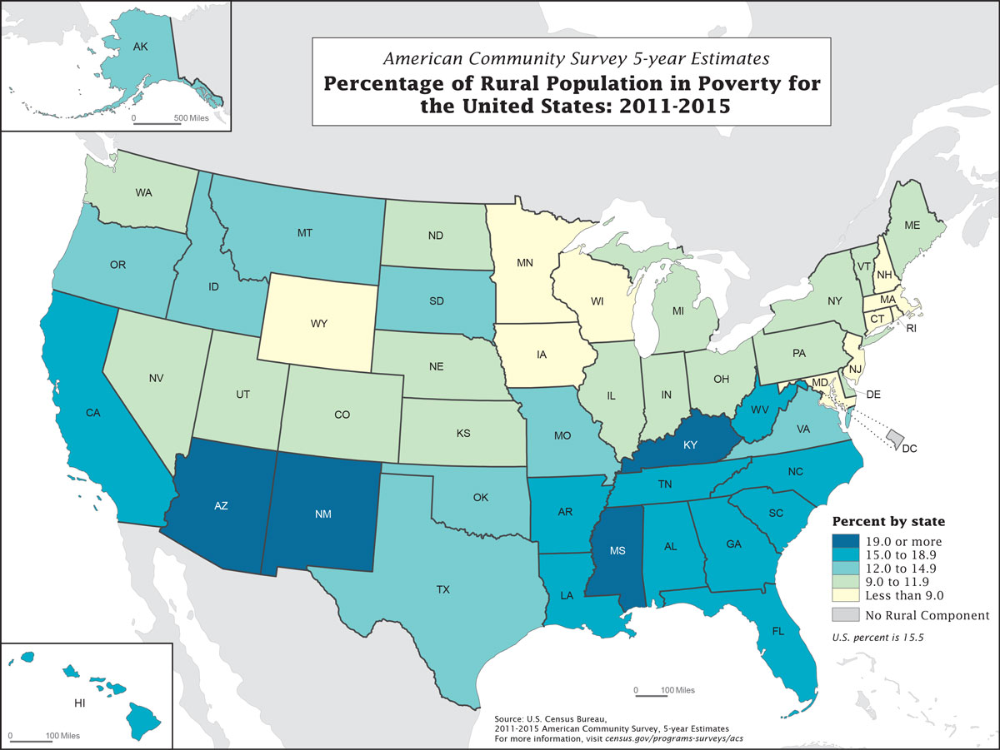

  Choropleth maps are best used to display the geographic distribution of data. You can also use a choropleth map to make comparisons between geographic areas, but be aware that any geographic patterns will depend on the method used to group your data. The data in a choropleth map can be categorical or numeric.

<h2>Examples</h2>

  

    <h3 class="usa-chart-title">Static Choropleth Map of the United States</h3>
  

  

    
  

