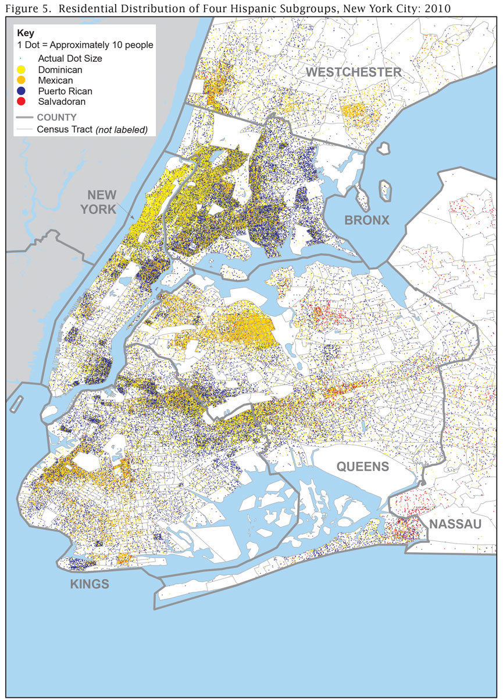

  Dot distribution maps are used to convey the intensity of an attribute. Each dot on the map represents one or more phenomena being mapped. The author of the map determines the value represented by each dot, and each dot is often placed randomly on the map based on the aggregate totals of their respective source polygons.

  A dot distribution map can be layered over other thematic map types. For example, a
  <a href="{{ site.baseurl }}/visualizations/choropleth-map">choropleth map</a> can be used underneath the dot distribution symbol to show two different variables.

<h2>Examples</h2>

  

    <h3 class="usa-chart-title">Static Dot Distribution Map of New York City</h3>
  

  

    
  

