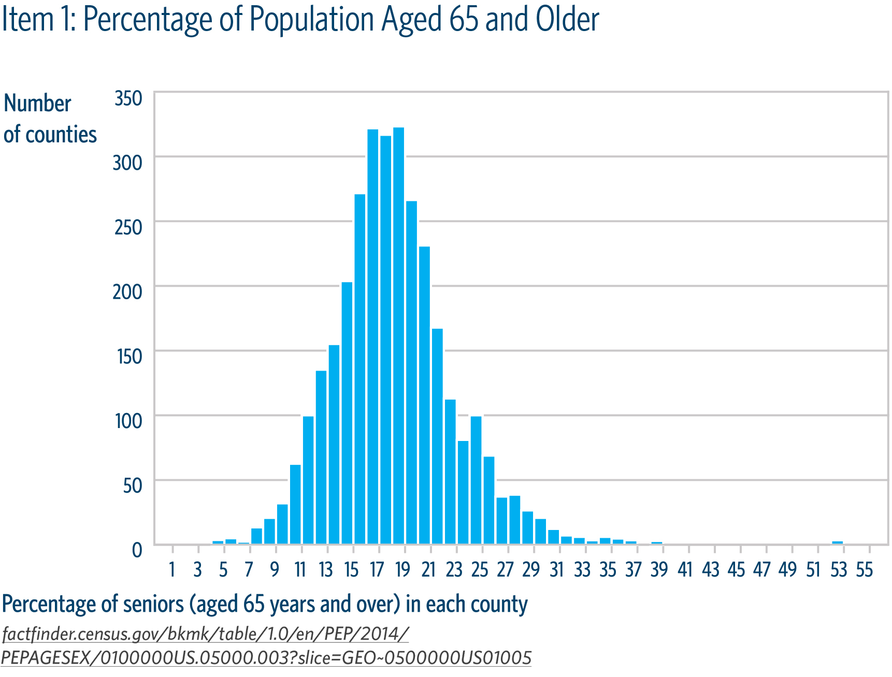

Like a bar chart, histograms consist of a series of vertical bars along the x-axis. Histograms are most commonly used to depict what a set of data looks like in aggregate. At a quick glance, histograms tell whether a dataset has values that are clustered around a small number of ranges or are more spread out.

<h2>Examples</h2>

  

    <h3 class="usa-chart-title">Static Histogram</h3>
  

  

    
  

