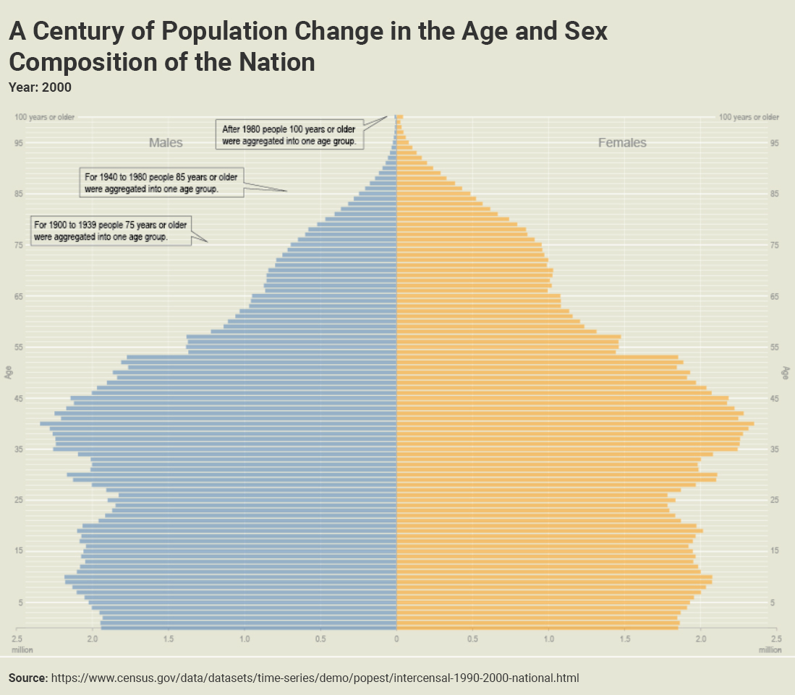

Population pyramids consist of a series of histogram bars on opposing sides, with one side representing male and the other female. Each row (or bin) of a population pyramid represents an age group and together they form the shape of a pyramid.

<h2>Examples</h2>

  

    
  

