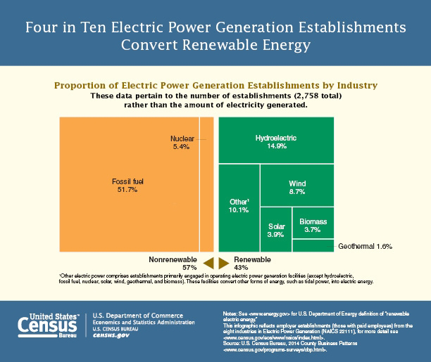

  A treemap gets its name from a tree diagram which is also used to display hierarchical data. The key difference with a treemap is that the size of each rectangle represents the value of each category of data, making it possible to convey more information about each category of data in a smaller space.

  Treemaps can be used to represent data that has a tree-like hierarchical relationship, such as age distribution within different groups of people or categories of exports in a country’s economy.

<h2>Examples</h2>

  

    <h3 class="usa-chart-title">Static Treemap</h3>
  

  

    
  

